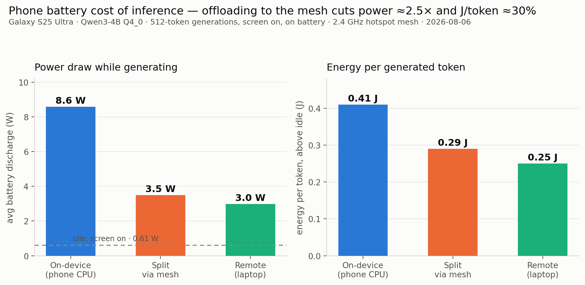
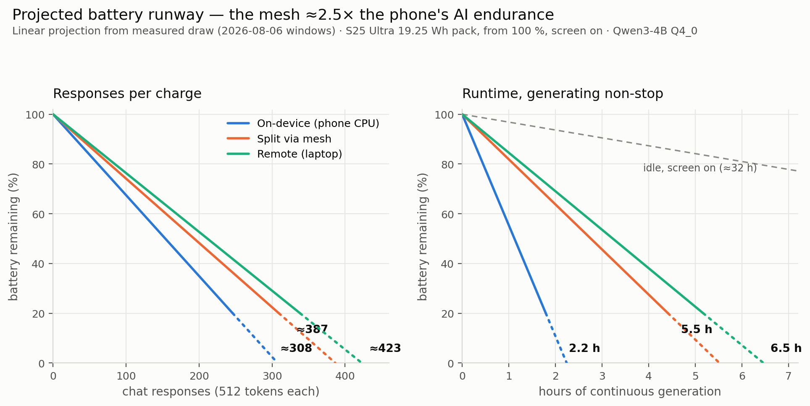
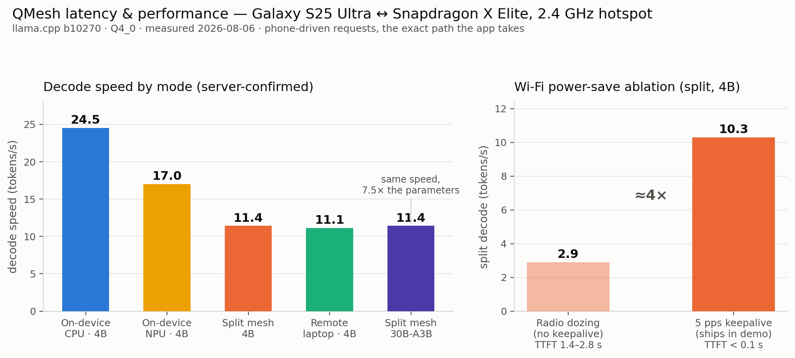
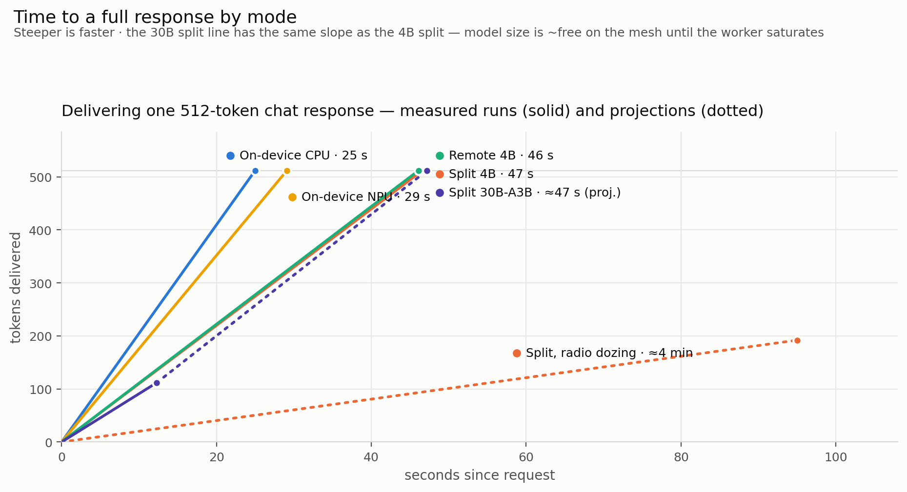

# QMesh — Experimental Results (2026-08-06)

Measured on the real demo hardware and topology: **Galaxy S25 Ultra** (Snapdragon 8 Elite,
11.4 GB RAM) as the inference MAIN, **Snapdragon X Elite Copilot+ laptop** as the mesh worker,
connected over the laptop's self-contained **2.4 GHz Wi-Fi hotspot**. Engine: llama.cpp
`b10270` (+ experimental Hexagon build), models Qwen3-4B-Instruct and Qwen3-30B-A3B, both
Q4_0 GGUF. Every number below traces to a raw file in this folder; the full lab narrative
lives in [`RUNLOG.md`](RUNLOG.md) and [`../split_rpc_validation/FINDINGS.md`](../split_rpc_validation/FINDINGS.md).

## 1. Capability — a 30B model on a phone that cannot hold it

| Configuration | Outcome |
|---|---|
| **Phone alone**, Qwen3-30B-A3B (17.4 GB) | **Zero tokens.** Never finished loading; memory thrash knocked the phone off Wi-Fi for ~10 min and killed its own tooling ([`bigmodel/oom30b.log`](bigmodel/oom30b.log)) |
| **QMesh split** — 4 layers on phone, 44 on laptop | **Correct answers at 7.2–11.5 t/s decode** (87–139 ms/token), prefill ~6 t/s ([`bigmodel/placement_evidence.txt`](bigmodel/placement_evidence.txt)) |

The 30B split decodes at the **same ~10 t/s as the 4B split** — the per-token network cost is
flat, so model size is nearly free until the worker saturates. **7.5× the parameters at equal
interactive speed.** Placement proof: 15.0 GB resident on the worker, 1.5 GB on the phone.

Weight logistics: the content-addressed RPC cache (`-c`) loads the 30B in **98 s with only
~0.5 GB over the air** once warmed (cold transfer would be ~16 GB). Caveat: warm the cache
through the same worker binary you deploy — entries do not hit across worker builds.

## 2. Energy efficiency — the mesh is a battery feature





1 Hz battery telemetry on the phone (`dumpsys battery`, V·I integral + coulomb-counter
cross-check), fixed 512-token generations driven from the phone, screen on at fixed
brightness, on battery. Data: [`energy/battery_merged.log`](energy/battery_merged.log) +
[`energy/marks_merged.txt`](energy/marks_merged.txt), analyzer in [`energy/tools/`](energy/tools/).

| Mode (Qwen3-4B) | Phone power | Energy/token (Δ over idle) | Decode t/s | Phone RSS |
|---|---:|---:|---:|---:|
| Idle, screen on | 0.61 W | — | — | — |
| On-device CPU | 8.6 W | 0.41 J | 19–24 | 5.27 GB |
| On-device NPU (Hexagon) | 8.5–12.6 W | 0.44–0.72 J | ~17 | **0.81 GB** |
| **Split via mesh** | **3.5 W** | **0.29 J** | 10–11 | ~1.0 GB |
| Remote (laptop NPU) | **3.0 W** | 0.25 J | ~11 | ~0 |

**Offloading through the mesh cuts the phone's power draw ~2.5× (8.6 → 3.5 W) and energy per
token ~30 %** while tokens keep flowing at interactive rates — plus a ~4 GB smaller memory
footprint on the handset.

## 3. Latency & performance





All figures measured 2026-08-06, phone-driven requests (the exact path the app takes),
server-log-confirmed token counts and timings:

| Mode | Model | Decode | Prefill | TTFT | 512-token response |
|---|---|---:|---:|---:|---:|
| On-device CPU | 4B | 24.5 t/s bench · ~20 t/s interactive | 127 t/s | ≲0.3 s | **25 s** |
| On-device NPU (HTP0) | 4B | 17.0 t/s | — ¹ | ≲0.1 s | 29 s |
| Split via mesh, keepalive | 4B | 11.4 t/s | ~85 t/s | <0.1 s hot | 47 s |
| Split via mesh, radio dozing | 4B | **2.1–3.7 t/s** | — | 1.4–2.8 s | ≈4 min ² |
| Remote (laptop NPU) | 4B | ~11 t/s at the phone ³ | — | ≲0.1 s | 46 s |
| **Split via mesh** | **30B-A3B** | **11.4 t/s** (87 ms/tok) | 6.4 t/s | ≈2.5 s | ≈47 s proj. |
| Phone alone | 30B-A3B | **0 — never loads** | — | — | — |

¹ NPU legs reused the prompt cache (1-token prefill) — no clean prefill figure.
² Measured 192 tokens in 95 s; extrapolated to 512.
³ NPU llama-server does ~15 t/s solo server-side; the experimental Hexagon backend, not the
network, is the remote bottleneck (laptop *CPU* llama-server measured 37.5 t/s on 08-05).

Two engineering takeaways:

- **Wi-Fi power-save, not bandwidth, dominates split latency** (ggml-rpc makes multiple
  round-trips per token; the doze rows above). A single 5 pps background ping restores ~4× of
  interactive speed and ships in the demo runbook. Remote-mode SSE suffers the same doze.
- **Model size is ~free on the mesh**: 30B-A3B decodes at the same ~11 t/s as 4B through the
  split — the fixed per-token network cost, not model compute, sets the pace until the worker
  saturates.

## 4. Resource utilization notes

- Controlled phone baseline (battery 90 %, 28 °C, r=3): **126.8 pp / 24.5 tg** — resolves the
  earlier 10.6-vs-25.5 t/s discrepancy as a device-state artifact
  ([`energy/bench_local_cpu_pp128tg32.txt`](energy/bench_local_cpu_pp128tg32.txt)).
- Laptop during split decode: ~52–57 % total CPU ([`energy/laptop_cpu_ka_windows.csv`](energy/laptop_cpu_ka_windows.csv)).
- Experimental Hexagon backend today: decode-slower than CPU on both devices (17 vs 24 t/s
  phone; ~15 vs 37.5 t/s laptop) and no energy win yet (`OPPOLL` busy-polling) — but a 6.5×
  smaller phone RAM footprint with weights resident on the NPU. Tracked as roadmap.
- **The mesh is a thermal feature, not just a battery one.** Battery-temp slopes during
  generation: on-device CPU **+1.9 °C/min**, on-device NPU **+2.9 °C/min** — vs **0.0 °C/min
  for split and remote** (the pack actually cooled 0.1 °C during the 104 s split window).
  Sustained on-device chat marches toward exactly the hot/throttled state that produced the
  bogus 10.6 t/s baseline we had to debunk; mesh modes can chat indefinitely at idle
  temperatures. (Slopes from `battery_merged.log` temperature field, per marked window.)
- **The phone's radio policy governs the *laptop's* utilization too.** During the radio-dozing
  split the X Elite worker averaged **31.6 %** CPU (spiking to 86 %, i.e. mostly waiting on the
  phone's radio); with the 5 pps keepalive it averaged **75.5 %** — the one-line keepalive
  ~2.4×'s the utilization of the biggest compute in the mesh (idle floor 4.9 %;
  `laptop_cpu_ka_windows.csv` / `laptop_cpu_kaon_remote.csv` sliced by run window).
- **Temp-0 determinism holds within a backend, not across backends.** Same model, same prompt,
  temperature 0: CPU and Hexagon builds produce different (both coherent) essays, first
  diverging at character 304 — "climate change *imperatives*" vs "climate change *awareness*"
  (fp accumulation-order differences; `stream_local_cpu_1.txt` vs `stream_local_npu_1.txt`).
  QA implication: correctness must be validated per backend, and the app should not promise
  bit-identical answers across modes.

## File map

```
results/
├── RESULTS.md                  ← this summary
├── RUNLOG.md                   ← full chronological lab log (commands, incidents, conditions)
├── energy/                     ← battery CSVs, window marks, curl timings, laptop CPU
│   └── tools/                  ← sampler, load driver, analyzer (reproduce: analyze_energy.py
│                                  battery_merged.log marks_merged.txt)
└── bigmodel/                   ← 30B split: placement evidence, phone-alone OOM log,
                                  server log, laptop loopback warm bench
```
